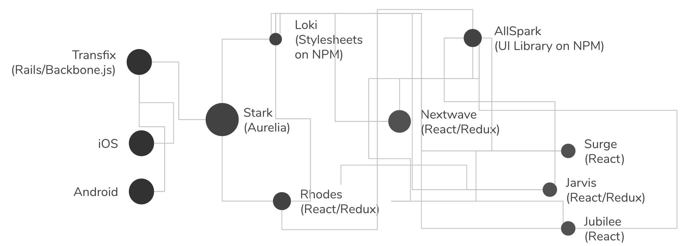
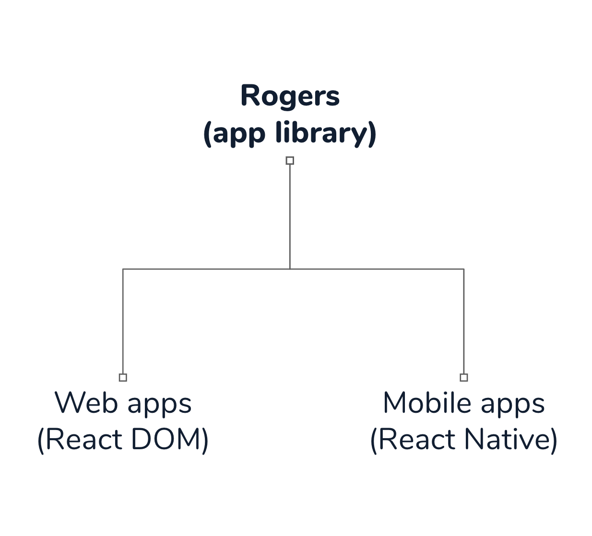
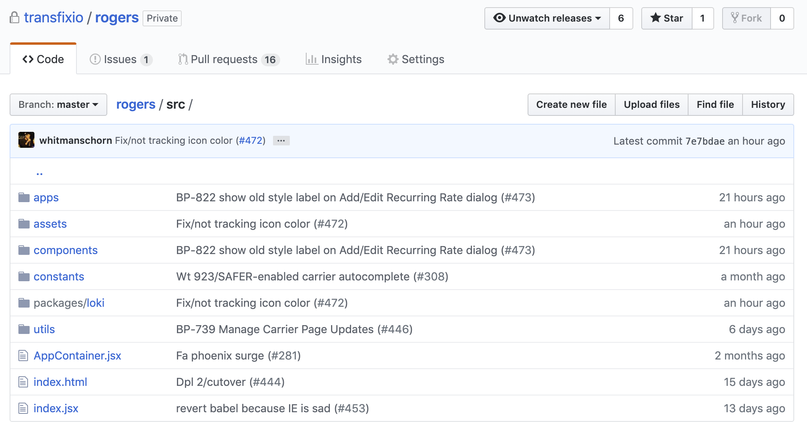
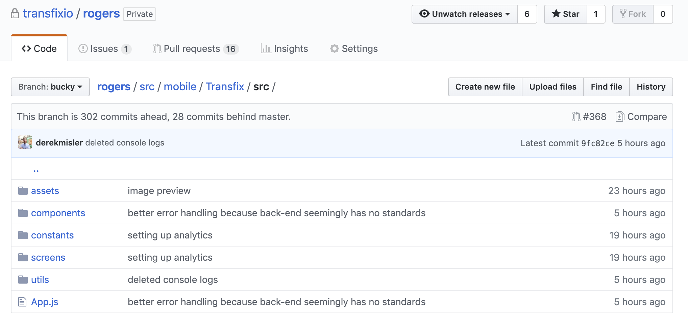

export { swiss as theme } from 'mdx-deck/themes'
import { Head, Image, Appear } from 'mdx-deck'
import { Split, SplitRight, FullScreenCode, Invert } from 'mdx-deck/layouts'

<Head>
  <title>React Native.</title>
</Head>

# React Native.
### It's not as fancy as you think.
---
export default Split

# Build native mobile apps using JavaScript and React

<ul>
  <li>React Native lets you build mobile apps using only JavaScript.</li>
  <li>It uses the same design as React.</li>
</ul>

---
export default Split

# A React Native app is a real mobile app

<ul>
  <li>They are not "mobile web apps"</li>
  <li>Uses native iOS and Android</li>
  <li>Instead of using Swift, Kotlin or Java, it's just JavaScript</li>
</ul>

---
export default Invert

# History lesson!

---
### Remember this?



---
export default Split

### So much better.



---
export default Invert

# Examples
### I don't know why everything is pink

---
export default Split

### React DOM

```jsx
const Button = props =>
  <button
    onClick={props.onClickHandler}
    disabled={props.disabled}
  >{props.buttonText}
  </button>
```

---
export default Split

### React Native

```jsx
const Button = props =>
  <TouchableOpacity
    onPress={props.onPressHandler}
    disabled={props.disabled}
  >{props.buttonText}
  </TouchableOpacity>
```

---
export default Split

### React DOM

```jsx
const TextLayout = props =>
  <div>
    <h1>{props.title}</h1>
    <p>{props.text}</p>
  </div>
```

---
export default Split

### React Native

```jsx
const TextLayout = props =>
  <View>
    <Text>{props.title}</Text>
    <Text>{props.text}</Text>
  </View>
```

---
export default Split

### CSS

```css
h1 {
  font-size: 32px;
  font-weight: bold;
}

h2 {
  font-size: 24px
  font-weight: normal;
}
```

---
export default Split

### StyleSheet

```js
const styles = StyleSheet.create({
  h1: {
    fontSize: fontSizes.lg,
    lineHeight: lineHeights.lg,
    fontWeight: 'bold'
  },
  h2: {
    fontSize: fontSizes.md,
    lineHeight: lineHeights.md,
    fontWeight: 'normal'
  }
})
```

---
export default Split

> Rogers


#
> Bucky


---
export default Invert

# Here's what annoys me

