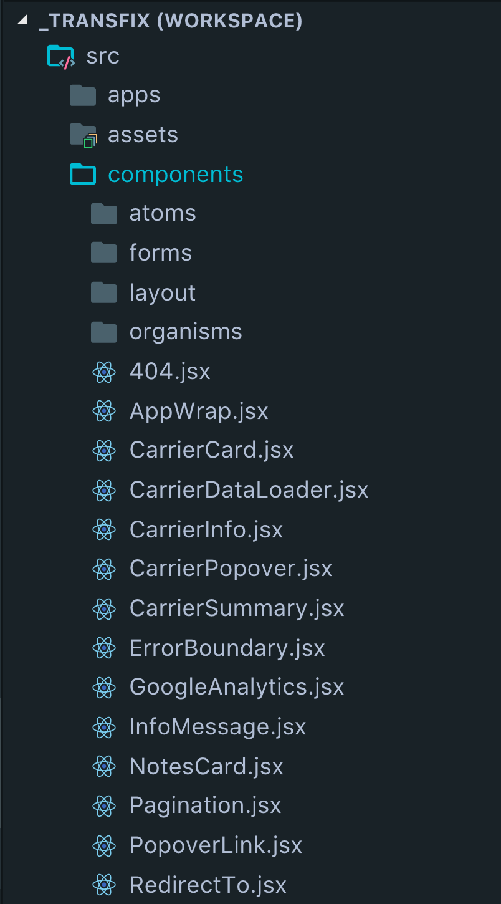
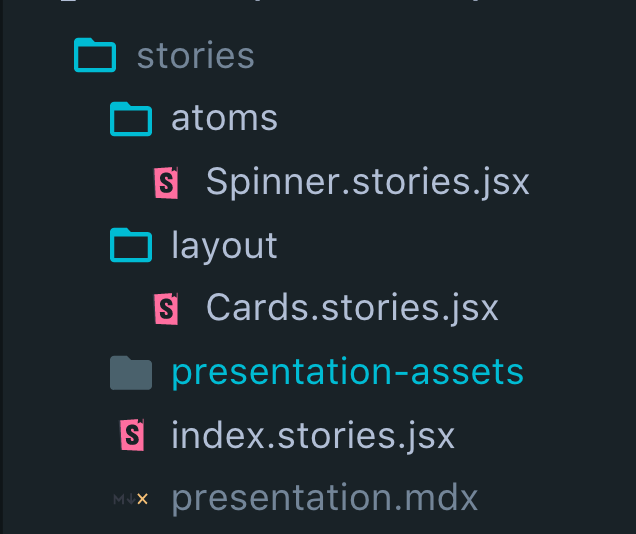

export { swiss as theme } from 'mdx-deck/themes'
import { Head, Image, Appear } from 'mdx-deck'
import { Split, SplitRight, FullScreenCode, Invert } from 'mdx-deck/layouts'

<Head>
  <title>Storybook.</title>
</Head>

# Storybook.
### What it is, why it's important, and how to use it.
---
export default Invert

# What.
---
export default Split

> The UI Development Environment You'll ♥️ to use


---

<Image src='./images/storybook-screenshot.png' size='cover' />

---
## Testable (via Jest and Enzyme)

## Customizable (via Addons)
---
# Addons
<ul>
  <li>Test compliance of your stories with web accessibility standards.</li>
  <li>Build demos and prototypes directly from your UI components.</li>
  <li>Edit React props dynamically using the Storybook UI.</li>
  <li>Build a nice-looking style guide with docs.</li>
  <li>Preview the JSX code for each story. Allows you to copy the code with a single click.</li>
  <li>Test responsive components in different viewports and layout.</li>
  <li>etc.</li>
  <li>etc.</li>
  <li>etc.</li>
</ul>

[Addon Gallery](https://storybook.js.org/addons/addon-gallery/)
---
export default Invert

# Why.
---
> [Developer] “Where is the latest design for this component?”
```notes
Developers often develop a new component in more than a single session. In each session they find themselves wondering if the design has been updated since the previous session. They’d start hunting for the latest design in a shared folder, email, Jira, Asana, Slack, or any other asset sharing platform where the last communication with the designer took place. Not the best part of a developer’s workday.
```
---
> [Developer] “The page includes a component that’s not in our system. Is it a revision of an existing component? Which one? Or maybe it’s a new component altogether?”
```notes
When developers interpret a page spec it’s hard to determine how to map components that appear in the spec to existing components in the system.
```
---
> [Designer] “Where can I find a live view of this UI component?”
```notes
As developers do their magic and bring a component to life, designers have limited visibility to the process and miss an opportunity to provide early feedback. Even when a component is finally live in production, designers often need to track it down by triggering the right flow in a production app.
```
---
export default Invert

# How.
---
export default Split

# [Designer]

<h1>
<ol>
  <Appear>
    <li>Design your component.</li>
    <li>Export your design.</li>
  </Appear>
</ol>
</h1>
---
export default Split

# [Developer]

<h1>
<ol>
  <Appear>
    <li>Build your component.</li>
    <li>Write your story.</li>
  </Appear>
</ol>
</h1>

---
export default Invert

```bash
npm run storybook
```
---
export default Split



```jsx
export const Spinner = () => (
  <div className='spinner' />
)
```
---
export default SplitRight



```js
storiesOf('Spinner', module)
  .add('default', () => <Spinner />)
```
---
# End.
###### (hidden speaker note) Hold for applause.
